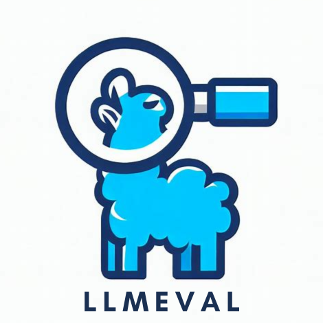

<p align="center">
  
</p>

<h2 align="center">LLMEval-Logic: A Solver-Verified Chinese Benchmark for Logical Reasoning of LLMs with Adversarial Hardening</h2>

<p align="center">
  <a href="https://arxiv.org/abs/2605.19597"></a>
  <a href="https://huggingface.co/datasets/llmeval-fdu/LLMEval-Logic"></a>
  <a href="https://llmeval.com/"></a>
  <a href="https://github.com/llmeval"></a>
  <a href="LICENSE"></a>
</p>

> **Note:** For the Chinese version of this README, please refer to [README_zh.md](README_zh.md).

## 🔔 News

- 🎉 **[2026-05]** Our paper is released on arXiv: [arXiv:2605.19597](https://arxiv.org/abs/2605.19597).
- 📂 **[2026-05]** **80% public release** is live. The remaining 20% (50 Base / 36 Hard / 50 rubrics) is held out as a private contamination-resistant test set maintained by Fudan NLP Lab.

## 📚 Overview

LLMEval-Logic is a Chinese logical reasoning benchmark built through a three-stage audited construction pipeline: (a) trained annotators **forward-author** each item from a real-world situational scenario rather than templating backward from formulas, (b) each item passes a four-layer normalization pipeline and is **double-audited** by an expert-developed rubric plus the **Z3 SMT solver**, and (c) surviving items are elevated through a closed-loop **adversarial-hardening agent workflow** that filters out items too easy for frontier models. The dataset has two paired splits:

- **LLMEval-Logic-Base** — single-question PL & FOL items with Z3-verified answers, gold formalizations, and atom-level NL→FL rubrics (1,400 atoms across 246 items; the public split ships 196 items).
- **LLMEval-Logic-Hard** — multi-question / sub-question items obtained by adversarially hardening Base items under six strategies (branching, effective distractors, explicit uncertainty, set-valued output, counterfactual variants, alias/coreference shifts). The strongest evaluated frontier model still only reaches **37.5%** Item Accuracy on Hard.

## 🗂️ Project Structure

```
.
├── bench/                                  the 80% public release
│   ├── base/                               Base items + paired rubrics
│   │   ├── llmeval_logic_base.json         196 items + gold FL + answers
│   │   └── rubrics/                        196 per-problem rubric files (NL+Z3 atoms)
│   └── hard/
│       └── llmeval_logic_hard.json         154 items / 766 sub-questions
│
├── code/
│   ├── client.py                           pluggable OpenAI-compatible model dispatch
│   ├── lib/                                shared HTTP / FL schema / Z3 engine / IO
│   │
│   ├── nl_eval/                            direct answer-accuracy track (Base + Hard)
│   │   ├── eval.py
│   │   └── llm_judge/
│   │
│   └── fl_eval/                            formalization-accuracy track (Base only)
│       ├── formalize/                      NL → candidate FL JSON
│       ├── z3_judge/                       Z3 execution  → "Z3" column
│       └── rubric_judge/                rubric atom scoring → "Rubric" column
│
├── scripts/split.py                        deterministic stratified splitter (seed=2026)
├── evaluate.py                             ★ one-command end-to-end evaluator
├── requirements.txt
└── .env.example                            copy to .env, fill OPENAI_BASE_URL + OPENAI_API_KEY
```

The repo layout mirrors the paper's two evaluation axes — `bench/base/` carries everything the formalization track needs (items + rubrics); `bench/hard/` is the multi-question subset used by the direct answer track only.

## 💾 Dataset Structure

### Base item (`bench/base/llmeval_logic_base.json`)

Each Base item is a JSON object with at least:

- **`id`** — global integer id assigned over the full 436-item corpus (Base spans `0..245`, Hard `246..435`). The same item keeps the same `id` in the public / private / full splits, and the id is also the rubric filename (e.g. `id=10` ↔ `bench/base/rubrics/010.json`).
- **`title`** — short Chinese tag for the item.
- **`logictype`** — `pl` (propositional logic) or `fol` (first-order logic).
- **`original.background` / `original.question` / `original.answer`** — Chinese natural-language premises, question, and reference answer (free text).
- **`formalization.parameters` / `.translation` / `.premise` / `.question` / `.answer`** — the hand-verified gold FL (parameters, NL→symbol mapping, formal premises, formal query, Z3-verified answer).
- **`label_type`** — list of answer-type tags (`possible`, `necessary`, `enumerate_models`, `count_models`, etc.).

The public split is a subset of these ids (`0..245`); the held-out private split is the complement. Both are gappy with respect to `0..245`.

### Hard item (`bench/hard/llmeval_logic_hard.json`)

Hard items live in the `246..435` portion of the same global id space and are deliberately formalization-free:

- **`id`** — global integer id (`246..435`). Public Hard ids are a subset of this range; held-out Hard ids are the complement.
- **`title`** — short Chinese tag (≤ 10 characters) summarising the scenario.
- **`background`** — Chinese NL setup of the scenario.
- **`question`** — list of sub-question strings.
- **`answer`** — list of sub-question gold answers (Z3- and human-double-checked); same length as `question`.

### Rubric file (`bench/base/rubrics/<id>.json`)

A per-problem rubric of atomic NL→FL faithfulness criteria, organised into three groups:

- **`logical_relation`** — does the candidate FL preserve the original logical relations?
- **`stated_constraint`** — are stated constraints preserved?
- **`query_alignment`** — does the query semantically match the NL question?

Each atom carries both a natural-language criterion and a Z3-checkable formula, so the production judge can mix solver-decided atoms (auto-pass via Z3 prefilter) with LLM-decided atoms.

## 🛠️ Usage Guide

```bash
git clone https://github.com/llmeval/LLMEval-Logic.git
cd LLMEval-Logic

pip install -r requirements.txt
cp .env.example .env
# Edit .env: set OPENAI_BASE_URL + OPENAI_API_KEY to any
# OpenAI-compatible endpoint (OpenAI / OpenRouter / vLLM / SGLang / Ollama / ...).

python evaluate.py --model openai/gpt-4o
```

`evaluate.py` is the single entry point. Pass any OpenAI-compatible model id and it runs all four stages (`nl-base`, `nl-hard`, `fl-free`, `fl-fixed`) end-to-end, then prints a final scoreboard. Every stage is fully **resumable** — re-running the same command picks up where the previous run left off.

Common flags:

```bash
# Use a different judge (default: openai/gpt-4o):
python evaluate.py --model my-model --judge-model anthropic/claude-3.5-sonnet

# Smoke-test on the first 3 items only:
python evaluate.py --model openai/gpt-4o --limit 3

# Skip a stage (or pin to one stage):
python evaluate.py --model openai/gpt-4o --skip nl-hard
python evaluate.py --model openai/gpt-4o --only fl-fixed
```

If your provider speaks OpenAI Chat Completions and your model id forwards as-is, no code edits are needed. For models that require extra request parameters (e.g. a reasoning toggle), register a friendly key in `code/client.py:MODEL_CONFIGS` and pass it to `--model`.

## 📊 Evaluation Metrics

| Stage      | Bench                                    | Metric             | What it measures                                                                       |
|------------|------------------------------------------|--------------------|----------------------------------------------------------------------------------------|
| `nl-base`  | `bench/base/`                            | Item / Sub-Q Acc   | Free-form answer matches Z3-validated reference (LLM-judged).                          |
| `nl-hard`  | `bench/hard/`                            | Item / Sub-Q Acc   | Same as above, on the adversarially hardened multi-question subset.                    |
| `fl-free`  | `bench/base/` + `bench/base/rubrics/`    | Z3 / Rubric / Both | Model invents its own symbol space → Z3 execution + per-atom rubric.                   |
| `fl-fixed` | `bench/base/` + `bench/base/rubrics/`    | Z3 / Rubric / Both | Gold parameters/translation injected; model only writes premise/question; rubrics scored with a Z3 prefilter. |

`Z3` = the model's FL, after Z3 execution, produces the natural-language answer matching the reference. `Rubric` = every hand-reviewed atom in `bench/base/rubrics/<id>.json` is satisfied (Z3+LLM hybrid). `Both` is the intersection — the strictest column.

All numbers in the paper are run with `gpt-5.1-chat` as the LLM-as-Judge, three independent samples averaged. Inter-judge agreement against two further frontier judges (Claude Opus 4.6, Gemini 3.1 Pro) gives pairwise Cohen's κ ∈ [0.873, 0.922] ("almost perfect" by Landis & Koch 1977).

## 🔐 Held-out 20%

Following the contamination-resistant evaluation tradition of [LLMEval-Fair](https://github.com/llmeval/LLMEval-Fair), only **80%** of LLMEval-Logic is released publicly. The remaining **20%** (50 Base / 36 Hard / 50 rubrics) is held out as a private contamination-resistant test set maintained by Fudan NLP Lab.

The split is produced by a deterministic, seeded (`seed=2026`) stratified random sample — Base by an answer-type-derived class (`enum / nec / pos / pos+nec / count / other`), Hard by sub-question-count bucket. `scripts/split.py` reproduces the public split bit-for-bit when run against the full corpus.

To submit a model for official evaluation against the holdout, please contact <mingzhang23@m.fudan.edu.cn>.

## 👥 Contributing

Contributions are welcome! Please feel free to submit issues and pull requests.

## 📮 Contact Us

For questions or suggestions, please:

- Open an issue on GitHub

- Contact the project maintainers:

  Ming Zhang: mingzhang23@m.fudan.edu.cn

## 📝 Citation

If you find this benchmark useful, please cite our work:

```bibtex
@misc{zhang2026llmevallogic,
  title         = {{LLMEval-Logic}: A Solver-Verified Chinese Benchmark for Logical Reasoning of LLMs with Adversarial Hardening},
  author        = {Ming Zhang and Qiyuan Peng and Yinxi Wei and Yujiong Shen and Kexin Tan and Yuhui Wang and Zhenghao Xiang and Junjie Ye and Zhangyue Yin and Zhiheng Xi and Shihan Dou and Tao Gui and Maxm Pan and Ruizhi Yang and Qi Zhang and Xuanjing Huang},
  year          = {2026},
  eprint        = {2605.19597},
  archivePrefix = {arXiv},
  primaryClass  = {cs.CL},
  url           = {https://arxiv.org/abs/2605.19597}
}
```

## 🔗 Related Projects

| Project | Description | Paper | Code |
|---------|-------------|-------|------|
| **LLMEval-Fair** (ACL 2026 Main) | Robust & fair evaluation across 13 disciplines, 200K+ questions | [arXiv](https://arxiv.org/abs/2508.05452) | [GitHub](https://github.com/llmeval/LLMEval-Fair) |
| **LLMEval-Med** (EMNLP 2025 Findings) | Physician-validated clinical benchmark | [arXiv](https://arxiv.org/abs/2506.04078) | [GitHub](https://github.com/llmeval/LLMEval-Med) |
| **LLMEval-2** (AAAI 2024) | Phase II: Professional domain evaluation | [arXiv](https://arxiv.org/abs/2312.07398) | [GitHub](https://github.com/llmeval/LLMEval-2) |
| **LLMEval-1** (AAAI 2024) | Phase I: General capability evaluation | [arXiv](https://arxiv.org/abs/2312.07398) | [GitHub](https://github.com/llmeval/LLMEval-1) |

Full project list & leaderboard: [llmeval.com](https://llmeval.com/) · All datasets: [🤗 llmeval-fdu](https://huggingface.co/llmeval-fdu)

---

<p align="center">
  <b>LLMEval</b> | Fudan University NLP Lab
</p>
